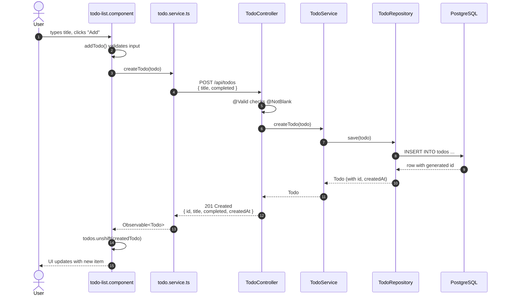
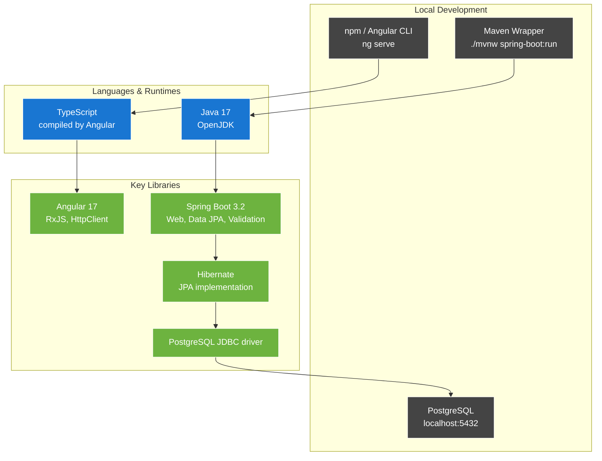

# Architecture

How the pieces of the TODO app fit together — files, layers, runtime flow.

## System Diagram

```mermaid
graph LR
    User([User Browser])

    subgraph Frontend["Angular Frontend — http://localhost:4200"]
        direction TB
        IndexHtml["index.html<br/><i>root HTML shell</i>"]
        MainTs["main.ts<br/><i>bootstraps Angular</i>"]
        AppMod["app.module.ts<br/><i>registers components & HttpClient</i>"]
        AppComp["app.component<br/><i>root component shell</i>"]
        TodoListComp["todo-list.component<br/>.ts / .html / .css<br/><i>UI + add/edit/delete logic</i>"]
        TodoSvc["todo.service.ts<br/><i>HTTP calls to backend</i>"]
        TodoModel["todo.model.ts<br/><i>TypeScript interface</i>"]

        IndexHtml --> MainTs --> AppMod --> AppComp --> TodoListComp
        TodoListComp --> TodoSvc
        TodoListComp -.uses type.-> TodoModel
        TodoSvc -.uses type.-> TodoModel
    end

    subgraph Backend["Spring Boot Backend — http://localhost:8080"]
        direction TB
        Pom["pom.xml<br/><i>Maven build + deps</i>"]
        Props["application.properties<br/><i>DB config, port</i>"]
        AppEntry["TodoApplication.java<br/>@SpringBootApplication<br/><i>entry point</i>"]
        Ctrl["TodoController<br/>@RestController<br/><i>/api/todos endpoints</i>"]
        Svc["TodoService<br/>@Service<br/><i>business logic</i>"]
        Repo["TodoRepository<br/>extends JpaRepository<br/><i>DB queries (auto-generated)</i>"]
        Ent["Todo.java<br/>@Entity<br/><i>table mapping</i>"]

        Pom -.builds.-> AppEntry
        Props -.configures.-> AppEntry
        AppEntry -.component scan.-> Ctrl
        AppEntry -.component scan.-> Svc
        AppEntry -.component scan.-> Repo
        Ctrl --> Svc --> Repo
        Repo -.reads/writes.-> Ent
    end

    DB[("PostgreSQL<br/>tododb<br/>todos table")]

    User -->|loads page| IndexHtml
    TodoSvc <-->|HTTP JSON<br/>GET/POST/PUT/DELETE| Ctrl
    Repo <-->|SQL via JPA / Hibernate| DB
    Ent -.maps to.-> DB

    classDef frontend fill:#dd0031,stroke:#fff,color:#fff
    classDef backend fill:#6db33f,stroke:#fff,color:#fff
    classDef db fill:#336791,stroke:#fff,color:#fff
    classDef config fill:#888,stroke:#fff,color:#fff
    class IndexHtml,MainTs,AppMod,AppComp,TodoListComp,TodoSvc,TodoModel frontend
    class AppEntry,Ctrl,Svc,Repo,Ent backend
    class DB db
    class Pom,Props config
```

## Backend Layer Responsibilities

The Spring Boot side follows a classic layered architecture. Each layer talks only to the one below it:

| Layer | File | Annotation | Responsibility |
|-------|------|------------|----------------|
| **Controller** | `TodoController.java` | `@RestController` | Receives HTTP requests, returns JSON. No business logic. |
| **Service** | `TodoService.java` | `@Service` | Business logic — what "create a todo" *means*. Calls repository. |
| **Repository** | `TodoRepository.java` | `extends JpaRepository` | Database access. Spring auto-implements CRUD for you. |
| **Entity** | `Todo.java` | `@Entity` | Maps a Java class to a database table. |

## Request Lifecycle — Creating a Todo

What happens when a user types a title and clicks "Add":

## Ecosystem & Tooling

## Reading Order If You're New

If you're trying to learn this codebase, follow the data:

1. **`Todo.java`** — what is a todo? (the shape)
2. **`TodoRepository.java`** — how do we read/write it? (one line!)
3. **`TodoService.java`** — wraps the repo with business logic
4. **`TodoController.java`** — exposes the service over HTTP
5. **`todo.model.ts`** — the same shape, in TypeScript
6. **`todo.service.ts`** — calls the backend
7. **`todo-list.component.ts`** — wires the service into the UI
